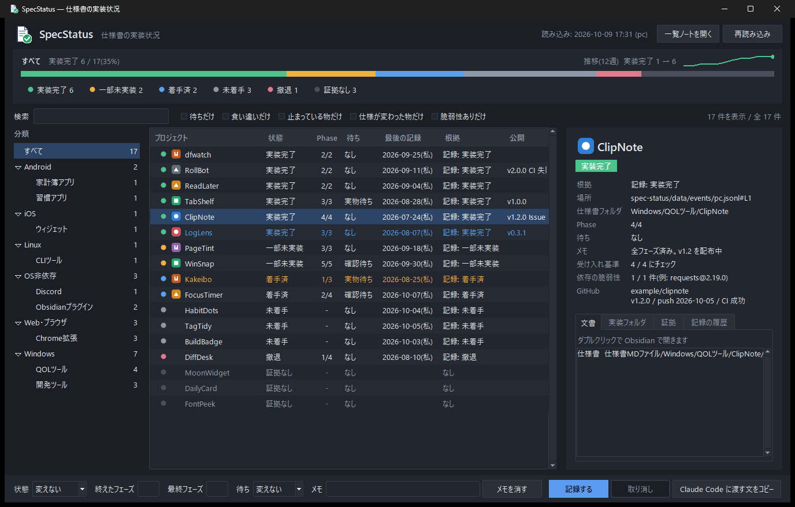
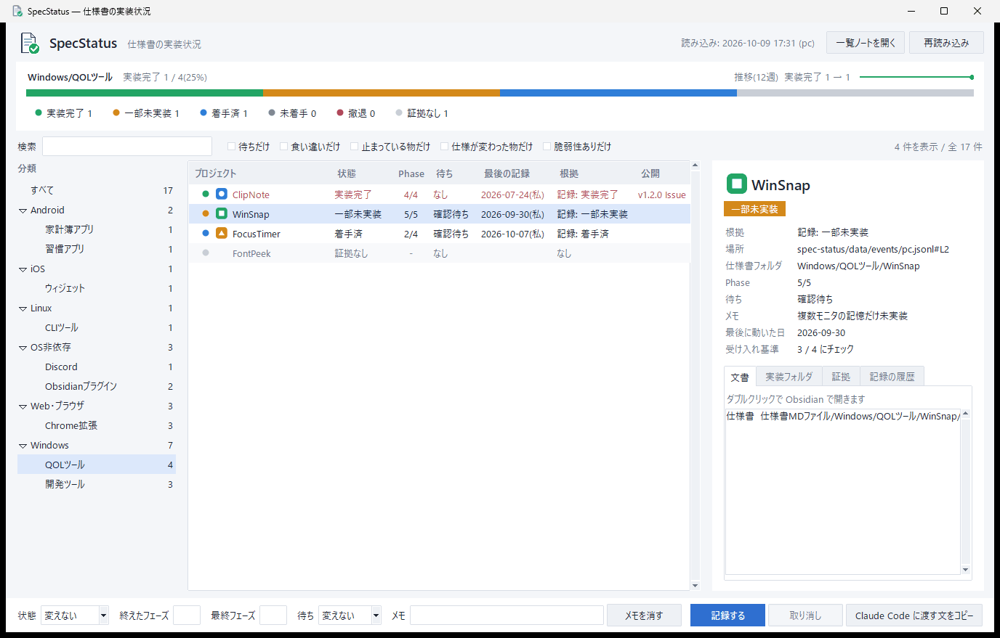
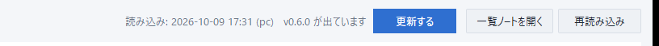
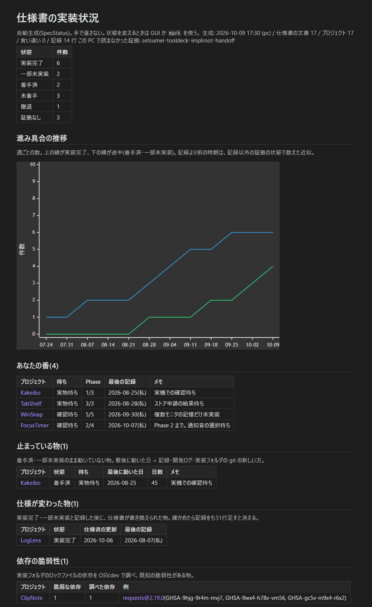

# SpecStatus

Obsidian の vault に置いた仕様書が「どこまで実装されたか」を、1か所で見る道具です。
仕様書を書いて Claude Code などに実装を任せていると、何十本・何百本になったあたりで「どれが済んで、どれが途中で、どれが手つかずか」が分からなくなります。それを一覧にします。

見る場所は3つあり、どれも同じ計算から作ります。

- **一覧ノート**(`仕様書MDファイル/00_実装状況.md`): Obsidian で開く Markdown。状態ごとの件数、進み具合の推移のグラフ、自分の確認待ち、止まっている物、最近動いた物、全件の表、GitHub の公開状況
- **GUI**: 絞り込み・詳細・記録ができる窓(tkinter)
- **JSON**(`仕様書MDファイル/00_実装状況.json`): Claude Code やほかの道具が読む

Python 3.11 以上の標準ライブラリだけで動きます。ネットワークに出るのは、GitHub の公開 API と raw のファイルを読むときだけです(登録・トークン不要)。読むのは、GUI を開いたときの新しい版の確認(1日1回まで)と、設定で GitHub のユーザー名を入れたときのリポジトリの情報とアイコンです。設定で `[osv] enabled = true` にしたときだけ、依存の一覧を OSV.dev(登録不要・無料)に送って既知の脆弱性を調べます。

## 画面





(画像はすべて `tools/demo_vault.py` で作った架空のプロジェクトで撮ったもの。GitHub のリポジトリ名も架空)

- 起動したときの Windows の「アプリのモード」に合わせて、ライトかダークで開きます。
- 行の頭に、状態の色の丸と**プロジェクトのアイコン**を出します(下の「アイコン」)。
- 左の分類(仕様書フォルダの1段目と2段目)で絞り込み、上の帯に、その分類の進み具合を状態の色で、右端に実装完了の数の週ごとの推移を出します。
- 状態の札を押すと、その状態だけに絞れます(複数選べます)。待ち・食い違い・止まっている物・仕様が変わった物・脆弱性ありでも絞れます。検索はプロジェクト名と仕様書フォルダに当たります。
- 行の色: 赤 = 食い違いか脆弱な依存、橙 = 止まっている、青 = 仕様が変わった、灰 = 証拠なし。
- 右の詳細には、状態を決めた根拠・受け入れ基準のチェック・依存の脆弱性・GitHub を出し、下のタブで文書・実装フォルダ・証拠・記録の履歴を見ます。文書はダブルクリックで Obsidian で開きます。
- 下の欄で、選んだ行の状態・フェーズ・待ち・メモを記録します。複数行を選べば、状態と待ちをまとめて記録できます。Ctrl+Z で取り消せます。

GitHub に新しい版が出ると、見出しに知らせが出ます(押したときだけ入れ替えます。下の「新しい版にする」)。



### 一覧ノート(Obsidian)

GUI と同じ中身を `仕様書MDファイル/00_実装状況.md` に書きます。推移のグラフは Mermaid なので、Obsidian がそのまま描きます。



## 状態の決め方

状態は次の6つです。

| 状態 | 意味 |
| --- | --- |
| 実装完了 | 作り終えた |
| 一部未実装 | 全フェーズを通したが、作っていない所が残る |
| 着手済 | 途中 |
| 未着手 | まだ手を付けていない(と記録した) |
| 撤退 | やめた |
| 証拠なし | 記録も証拠も無い(「未着手」とは区別する) |

状態は2種類の材料から決めます。

- **記録**: `mark` コマンドか GUI で足す1行。`spec-status/data/events/<PC名>.jsonl` に追記だけしていき、書き換えはしません。取り消しも「元の値に戻す記録」を足して行います。PC ごとに別のファイルなので、vault を同期している複数の PC から記録しても衝突しません。
- **証拠**: 読むだけの材料。説明書のノート、ツールの台帳(TOML)、実装フォルダの有無、引き継ぎメモの `状態:` の行、開発ログに出てきた日付。どれも設定で場所を決め、使わない物は空にすれば読みません。

記録があれば記録が勝ちます。記録と証拠が食い違えば「食い違い」として出します(GUI と `check`)。

仕様書は、ファイル名(拡張子なし)を `[docs] kinds` の正規表現に当てて種類を決めます。H1 からプロジェクト名を取り、同じフォルダで同じ名前の文書を1つのプロジェクトにまとめます。「実装フェーズ」を含む見出しの下の表から、最後のフェーズの番号を読みます。

## 時間の流れ・GitHub・中身の点検

- **止まっている物**: 「着手済」「一部未実装」のまま `[board] stale_days`(既定 30)日以上動いていない物。最後に動いた日は、記録・開発ログ・実装フォルダの git の最後のコミットのうち新しい日です。GUI では橙色の行と「止まっている物だけ」、CLI では `list --stale`。
- **進み具合の推移**: 実装完了と途中の数を週ごとに数え、一覧ノートに Mermaid の折れ線(Obsidian がそのまま描きます)、GUI の上の帯に小さな折れ線で出します。記録より前の時期は、記録以外の証拠の状態で数えた近似です。
- **週のまとめ**: `weekly` は、その週(月〜日)の状態の数の増減・状態が変わった物・確認待ちになった物・止まっている物・GitHub で動いた物を Markdown で出します。`--write` を付けると `[weekly] dir` に `<その週の金曜>_実装状況.md` として書きます(同じ週は上書き)。
- **GitHub**: `[github] owner` に GitHub のユーザー名を入れると、公開リポジトリの最新の版・最後の push・CI の結果を、プロジェクトの「公開」の欄・詳細・一覧ノートに出します。
  - リポジトリとプロジェクトは、名前を英数字だけにして比べて結びます(`SpecStatus` と `spec-status` が当たります)。当たらない物は `[github] repos` に「プロジェクト名 = リポジトリ名」で書きます。
  - 登録不要の API は1時間に60回までです。結果はこの PC の `%LOCALAPPDATA%\SpecStatus\` に保存し、`refresh_hours`(既定 6)時間より古い物だけ ETag 付きで聞き直します(変わっていなければ回数に数えられません)。上限や通信の失敗では前の結果を使い、一言だけ出します。

- **仕様が変わった物**: 「実装完了」「一部未実装」と記録した後に仕様書(付属の文書を除く)が書き換えられた物を出します(ファイルの更新日時と最後の記録を比べます)。確かめたら、記録をもう1行足すと消えます。GUI は青い行と「仕様が変わった物だけ」、CLI は `list --changed`。
- **受け入れ基準のチェック**: 仕様書の `- [ ] AC-1: …` の形のチェックボックスを数え、「AC 3/12」のように出します(一覧ノートの「AC」の列・詳細)。Obsidian でチェックを付ければ進みます。SpecStatus は仕様書を書き換えません。
- **依存の脆弱性**: `[osv] enabled = true` のとき、この PC にある実装フォルダ(とその2段下まで)の `package-lock.json`・`requirements.txt`(`==` で固定した行)・`poetry.lock`・`uv.lock`・`Cargo.lock` を読み、[OSV.dev](https://osv.dev/) で既知の脆弱性がある依存を数えます。結果はこの PC の `%LOCALAPPDATA%\SpecStatus\osv.json` に残し、依存ごとに1日1回まで聞き直します。GUI は赤い行と「脆弱性ありだけ」、CLI は `list --vuln`。
- **Issue とバッジ**: GitHub の公開状況に、開いている Issue の数(プルリクエストを含む)を足しました。一覧ノートの GitHub の表には shields.io(登録不要)の版と CI のバッジを並べ、Obsidian で開くたびに最新を描きます。

## アイコンとショートカット

- **プロジェクトのアイコン**: この PC の実装フォルダの中から探します。Chrome 拡張の `manifest.json` の `icons`、統合版アドオンの `pack_icon.png`、Android の `mipmap-*/ic_launcher.png`、`icon.png`・`app_icon.ico`・`logo.png` などの順です(`node_modules` やビルドの出力は見ません)。無ければ、公開中の GitHub リポジトリのファイルの一覧(API を1リポジトリにつき7日に1回)から同じ順で探し、raw で落とします。縮めた画像はこの PC の `%LOCALAPPDATA%\SpecStatus\icons\` に置き、元のファイルが変わるまで使い回します。PNG と ICO(中に PNG が入っている物)を読みます。
- **タスクバー**: `start_gui.cmd`(pythonw)で開いても、Python のアイコンにまとめられず、SpecStatus のアイコンで出ます。
- **ショートカット**: `python specstatus.py shortcut` で、デスクトップとスタートメニューに SpecStatus のアイコンつきのショートカットを作ります(pythonw で GUI を開く)。exe を使うなら `--exe <SpecStatus.exe のパス>`。

## 動作環境

- Windows 10 / 11(Windows 11 で確認しています)。GUI の見た目、Obsidian で開く機能、exe は Windows 向けです。
- Python 3.11 以上(`tomllib` を使います)。依存はありません。
- 一覧ノートを見るには Obsidian。無くても GUI と JSON は使えます。

## まず試す

架空のプロジェクト 17 本を入れたお試し用の vault を作って開きます。

```
python tools/demo_vault.py C:\temp\DemoVault
python specstatus.py gui --vault C:\temp\DemoVault --config C:\temp\DemoVault\spec-status\data\config\demo.toml
```

## 入れ方

1. vault の中に、仕様書を `仕様書MDファイル/<OS>/<分類>/<プロジェクト>/<名前>_<説明>_仕様書.md` の形で置きます(段の数は自由。分類の木は1段目と2段目を使います)。
2. このリポジトリを vault の `spec-status/` に写します。`python deploy.py --vault <vault>` で写せます(`data/` の中には触りません)。
3. `config.example.toml` を `<vault>/spec-status/data/config/<PC名>.toml` に写して、証拠の場所を自分の vault に合わせます。`<PC名>` は Python の `platform.node()` の値です。
4. `python <vault>/spec-status/specstatus.py build` で一覧ノートと JSON ができます。

vault を Obsidian Sync で同期するときは、「その他のファイル形式」をオンにしないと `.py` と `.jsonl` が届きません(設定は PC ごとです)。

## 使い方

```
python specstatus.py list  [--state <状態>]... [--waiting] [--conflict] [--stale] [--changed] [--vuln] [--os <OSフォルダ名>] [--json]
python specstatus.py show  <宛先> [--history <件数>] [--json]
python specstatus.py where [<フォルダ>] [--json | --hook]
python specstatus.py mark  <宛先> [--state <状態>] [--done-phase <番号>] [--last-phase <番号>]
                                  [--waiting なし|確認待ち|実物待ち] [--note <1行>] [--impl <フォルダ>]... [--unimpl <フォルダ>]...
                                  [--clear-state] [--by user|claude-code|claude] [--confirmed] [--no-build]
python specstatus.py build
python specstatus.py check
python specstatus.py weekly [--date <YYYY-MM-DD>] [--write]
python specstatus.py update [--check]
python specstatus.py shortcut [--exe <SpecStatus.exe のパス>]
python specstatus.py gui
```

- 共通の引数は `--vault <パス>`(省略すると `specstatus.py` の1つ上のフォルダ)と `--config <パス>` です。
- `<宛先>` は、仕様書のパス・ファイル名・プロジェクト名のどれでも渡せます。別の PC の vault のパスでも、ファイル名で決まります。
- `where` は、今いるフォルダがどのプロジェクトの実装フォルダかを答えます。`--impl` には作業フォルダの**根**を渡してください(`where` は「同じか、その下か」で比べます)。
- `mark` は記録を1行足して、一覧ノートと JSON を作り直します。
- `list --stale` は止まっている物、`--changed` は仕様が変わった物、`--vuln` は脆弱な依存がある物だけを出します。`weekly` は週のまとめを出します(下の「時間の流れ・GitHub・中身の点検」)。

### 終了コード

| コード | 意味 |
| --- | --- |
| 0 | 完走。`check` では問題 0 件 |
| 1 | `check` で問題が1件以上(食い違い・記録の問題・宛先の無い記録・registry の不整合) |
| 2 | 設定・引数の不備、出力先が許可外、仕様書のフォルダが無い、出力の置き換えに失敗 |
| 3 | 証拠の読み手のどれかが読めなかった(他は完走。`build` と `mark` は出力も書いた) |
| 4 | 宛先が1つに決まらない(候補を出す) |
| 5 | `--by claude-code` で `実装完了` か `撤退` を `--confirmed` 無しで付けようとした |
| 6 | ロックが取れなかった(同じ PC で別の `mark` が書いている) |

## Claude Code と使う

Claude Code に仕様書を渡して実装させるときは、次のような節を `CLAUDE.md` に書いておくと、着手前に状態を確かめ、区切りごとに記録するようになります(`ss` は `python <vault>/spec-status/specstatus.py`)。

```markdown
## 仕様書の実装状況の記録(SpecStatus)

- 着手する前に `ss show "<仕様書>"` を実行する。状態が「実装完了」「撤退」なら、始めずに確認する。
- まだ記録が無ければ `ss mark "<仕様書>" --state 着手済 --impl "<作業フォルダ>" --by claude-code`。
- フェーズを終えて止まるときは `ss mark "<仕様書>" --done-phase <番号> --waiting 確認待ち --note "<1行>" --by claude-code`。
- 「完了にして」と言われたときだけ `--state 実装完了 --confirmed` を付ける。
```

`--by claude-code` のときは、`実装完了` と `撤退` に `--confirmed` が要ります(人が言っていないのに AI が「完了」にしないため)。

セッションの始めに、そのフォルダが何の実装かを Claude Code に見せたいときは、SessionStart フックで `ss where --hook` を呼びます。当たらなければ何も出さず、いつも終了コード 0 です。

## 新しい版にする

GUI を開いたとき(1日1回まで)に [GitHub の Releases](https://github.com/takosasi-dev/spec-status/releases) を見て、新しい版があれば上に「v0.3.0 が出ています [更新する]」を出します。押すまでは何も変えません。

- **vault の spec-status/**: Release のソースで、`specstatus.py` などの実行物と `specstatus/` を入れ替えます。`data/`(設定と記録)には触りません。vault を同期していれば、ほかの PC にも届きます。
- **exe**: Release に付いた `SpecStatus-v<版>-windows.zip` を隣に広げ、窓を閉じた後に入れ替えて開き直します(PowerShell を使います)。`vault.txt` は引き継ぎます。

CLI では `python specstatus.py update` で vault の spec-status/ を最新にします(`--check` は確かめるだけ)。版の分からない古い置き方(v0.2.0 以前)からは、一度だけ手で置き直してください。

## exe にする

GUI だけを窓アプリにできます(CLI は `python specstatus.py` のまま)。

[Releases](https://github.com/takosasi-dev/spec-status/releases) の `SpecStatus-v<版>-windows.zip` を広げれば、そのまま使えます。初めて開いたときに vault のフォルダ(`spec-status/` を置いた物)を選ぶと、隣の `vault.txt` に覚えます。

自分で作るときは PyInstaller が要ります。

```
python build.py --vault <vault> [--zip]
```

`dist/SpecStatus/SpecStatus.exe` ができ、隣の `vault.txt` に書いた vault を開きます。`--zip` を付けると、Release に付ける zip(`vault.txt` を入れない)も作ります。exe は作った時点のコードを抱えているので、コードを直したら作り直してください。

## 開発

```
python -m pytest -q          # テスト
python tools/make_icon.py    # アイコンを描き直す(Pillow が要る。本体は使わない)
python tools/demo_vault.py <場所>   # お試し用の vault
```

画面の文言は `specstatus/strings.py`、色は `specstatus/theme.py` にまとめてあります。

## 注意と既知の限界

- 2台の PC の時計がずれていると、記録の順が実際の順と入れ替わることがあります。そのまま受け入れ、履歴に PC 名を出します。
- 別の PC にしか無いフォルダは、実装フォルダとして足せません(足すときに、その PC にあるかを確かめるため)。
- GUI を開いている間にほかの PC や Claude Code が記録した物は、F5 か [再読み込み] で反映します。
- 証拠の読み手は作者の vault の作り(説明書・ツールの台帳・引き継ぎメモ)に合わせてあります。使わない物は設定で空にしてください。
- 実装フォルダの最後のコミット日は `git` コマンドで読みます。git が無ければ、記録と開発ログの日付だけで決めます。

## ライセンス

MIT。[LICENSE](LICENSE) を見てください。

## 開発状況

作者が自分の vault(仕様書 250 本ほど)で使い始めたところです(v0.5.0)。Windows 11 でだけ確認しています。
